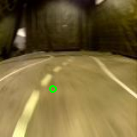

# Project Tuatara

We are a team of two students trying to win an autonomous car competition in Paris. You will find here our approach and code.

## Method 1 : Regression of the center of the road

Our car has a camera on board. We can use a CNN to predict the center of the road and then try to move the car to the predicted center.



You need to use RoadDataModule in data/ and RoadRegression in models/

### Usage
```bash
python train.py RoadRegression
```

## More to come